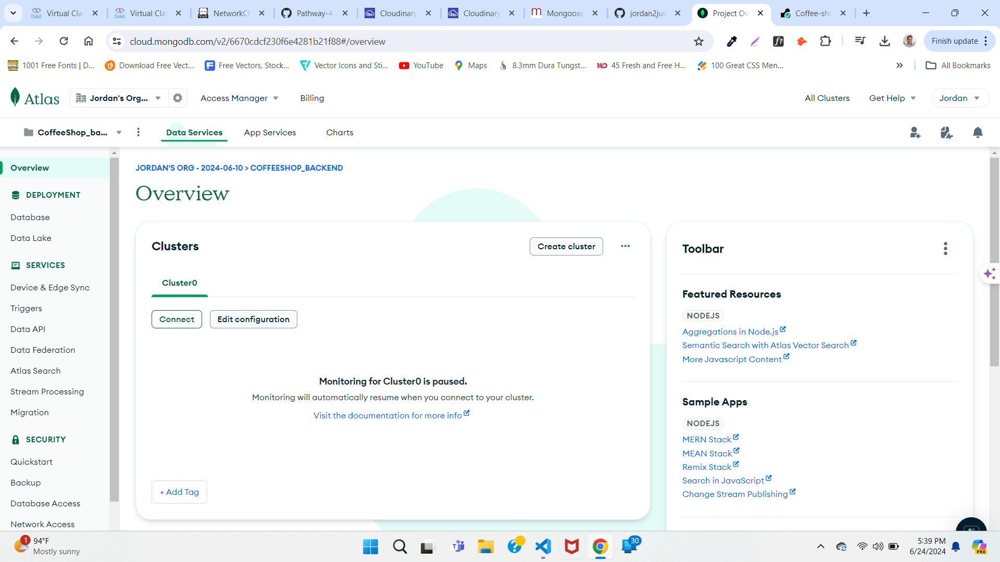
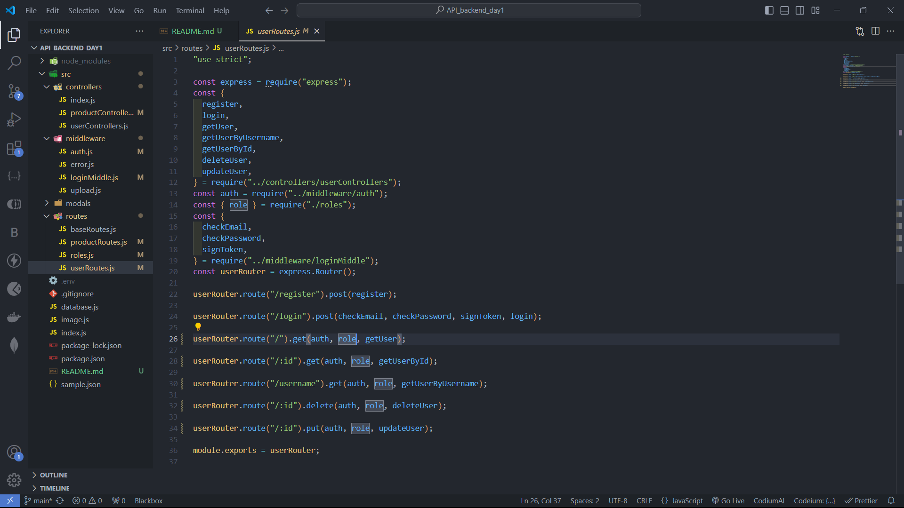
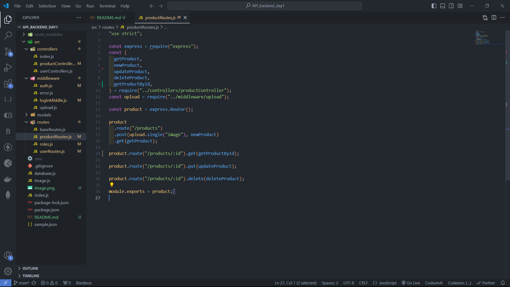
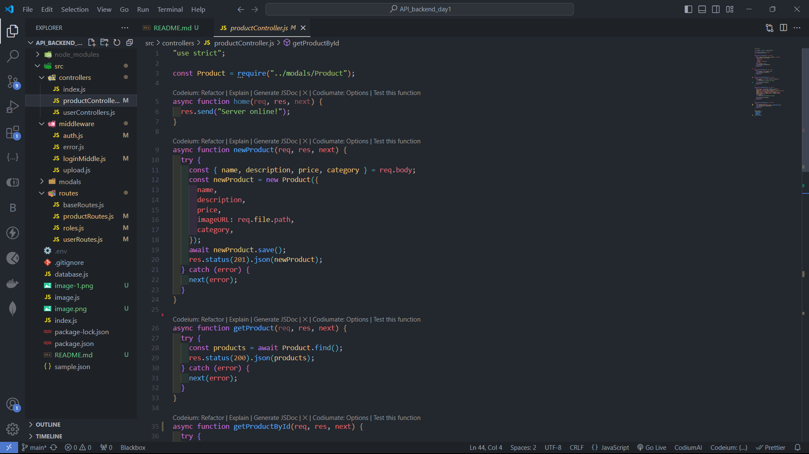
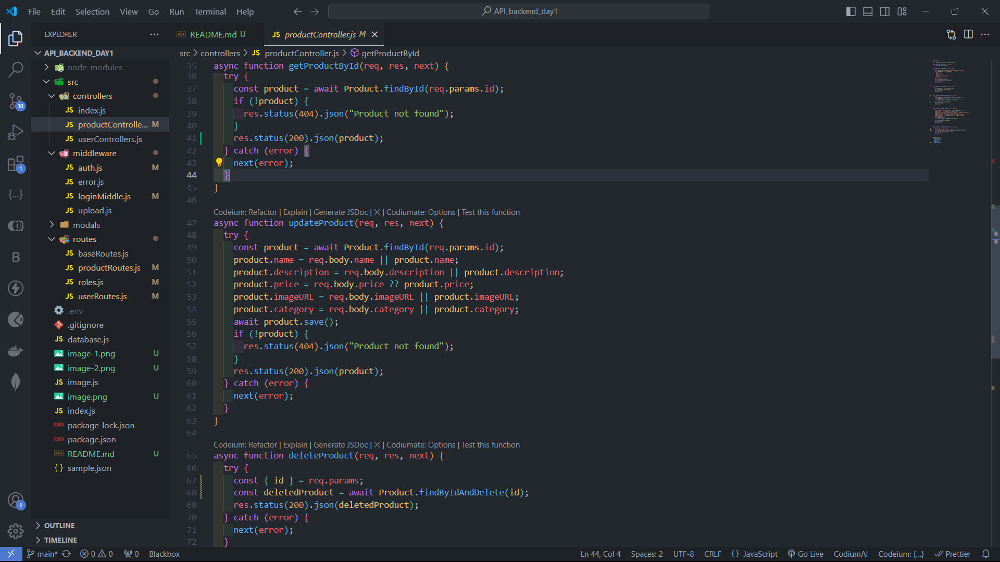
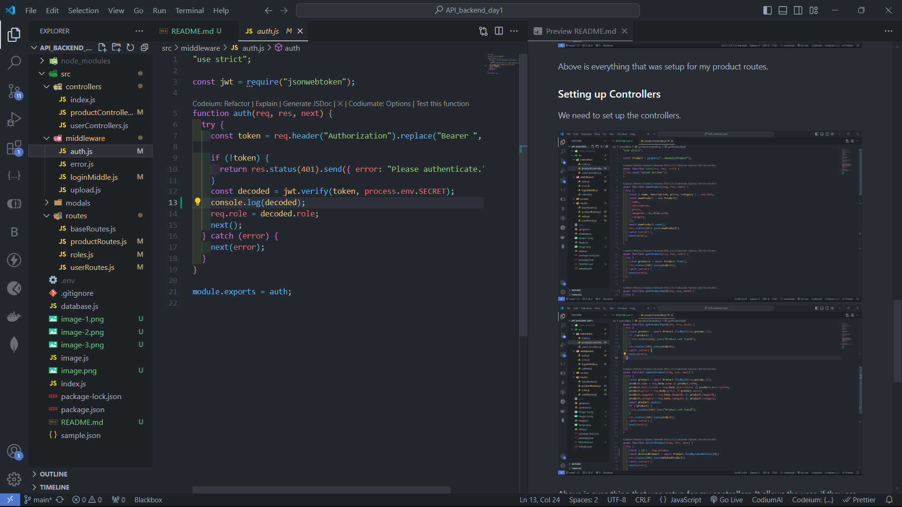
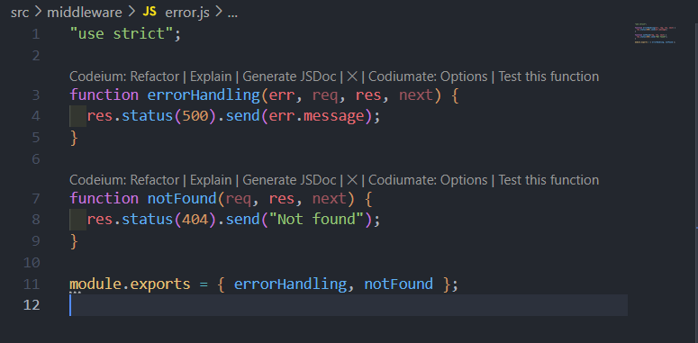
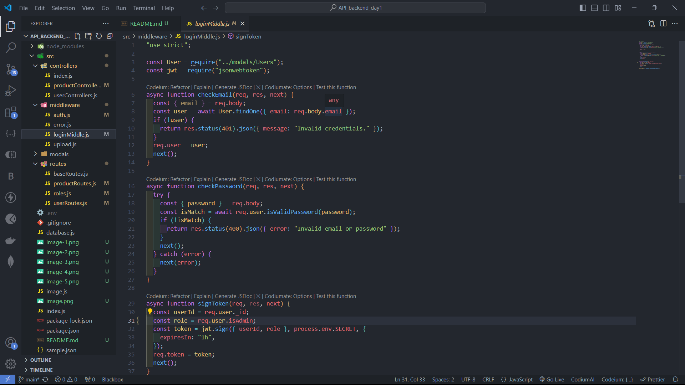

# Coffeeshop Backend

## Introduction

This is a simple backend API for a coffee shop. It allows users to create, read, update user information as well as product information as well. This is going to be a two part project. The first part is the backend which uses Express.js, MongoBD, Mongoose to talk to MongoDB and Cloudinary to host and supply the links for the images.

## Setting Express.js

First, we need to install Express.js. We can do this by running the following command in our terminal.

```bash
npm init -y
npm install express
```

Next, we need to create a new file called `index.js` and add the following code to
it.

```javascript
const express = require("express");
const app = express();
const port = 3011;

app.get("/", (req, res) => {
  res.send("Hello World!");
});

app.listen(port, () => {
  console.log(`Example app listening on port ${port}`);
});
```

I installed nodemon, cors, dotenv to help run the application.

## Setting up Mongoose & MongoDB

### MongoDB

We need to install MongoDB. MongoDB is the database that was used.



Above is a screenschot of the MongoDB and the database that I created.

### Mongoose

We need to install Mongoose and MongoDB. MongoDB is the database that was used and Mongoose is what I used to talk to MongoDB.

```bash
npm install mongoose
```

Next, we need to create a new file called `database.js` and add the following code to it.

```javascript
const mongoose = require("mongoose");

const DB = process.env.DB;

async function mongooseConnect() {
  await mongoose.connect(DB);
}

main().catch((err) => console.log(err));

module.exports = mongooseConnect;
```

Now we can connect to MongoDB and run the application.

```bash
node index.js
```

## Setting up User & Product Routes, Controllers & Middleware.

Now we need to set up the routes.

### Setting up User Routes

We need to create a new file called `userRoutes.js` & `productRoutes.` and add the following code to it.



Above is everything that was setup for my user routes.



Above is everything that was setup for my product routes.

### Setting up Controllers

We need to set up the controllers.




Above is everything that was setup for my controllers. It allows the user, if they are an admin to edit, create, update, & delete user information and user data.

### Setting up Middleware

We need to set up the middleware. For the middleware I have created several files. It handles the login, registration, error, handling & authorization.






## Setting up Cloudinary

We need to set up Cloudinary. Cloudinary is used to host and supply the links for the images. The screenshot below is the my Cloudinary storage for my images.


Then I installed the Node module multer.

```bash
npm install multer
```

I made a config file to get the images to generate a link for the images.

```javascript
"use strict";

require("dotenv").config();
const cloudinary = require("cloudinary").v2;
const { CloudinaryStorage } = require("multer-storage-cloudinary");

// Configuration
cloudinary.config({
  cloud_name: process.env.CLOUDINARY_CLOUD_NAME,
  api_key: process.env.CLOUDINARY_API_KEY,
  api_secret: process.env.CLOUDINARY_API_SECRET,
});

const storage = new CloudinaryStorage({
  cloudinary,
  params: { folder: "coffee", allowedFormats: ["jpg", "png", "jpeg"] },
});

module.exports = { cloudinary, storage };
```

Above is the configuration for Cloudinary.

## Deploying it on Render

We need to deploy it on Render. The project is deployed on Render and everything seems to be working properly.

With Render having my project go live it completes the assignment.

## Conclusion

This is a simple backend API for a coffee shop. It allows users to create, read, update user information as well as product information as well.

## References

- https://www.cloudinary.com/documentation/nodejs_image_uploading
- https://www.npmjs.com/package/multer-storage-cloudinary
- https://www.npmjs.com/package/multer
